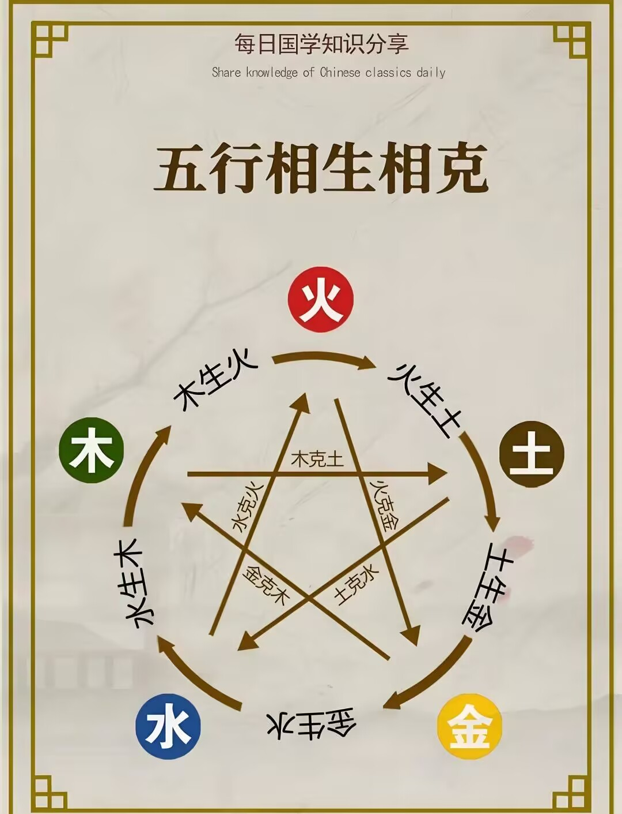

# 五行

### 根骨命定篇

此乃命定根骨之属，依五行生克之理，择器配装：合相生则增效，逢相克则损碍，此天道循环之数也。

### 五行相生序

其序如下：\
木生火，火生土，土生金，金生水，水生木，如环无端，生生不息。

### 五行相克纪

其纪如下：\
木克土，土克水，水克火，火克金，金克木，犹权衡相制，刚柔相济。

<figure><figcaption></figcaption></figure>
